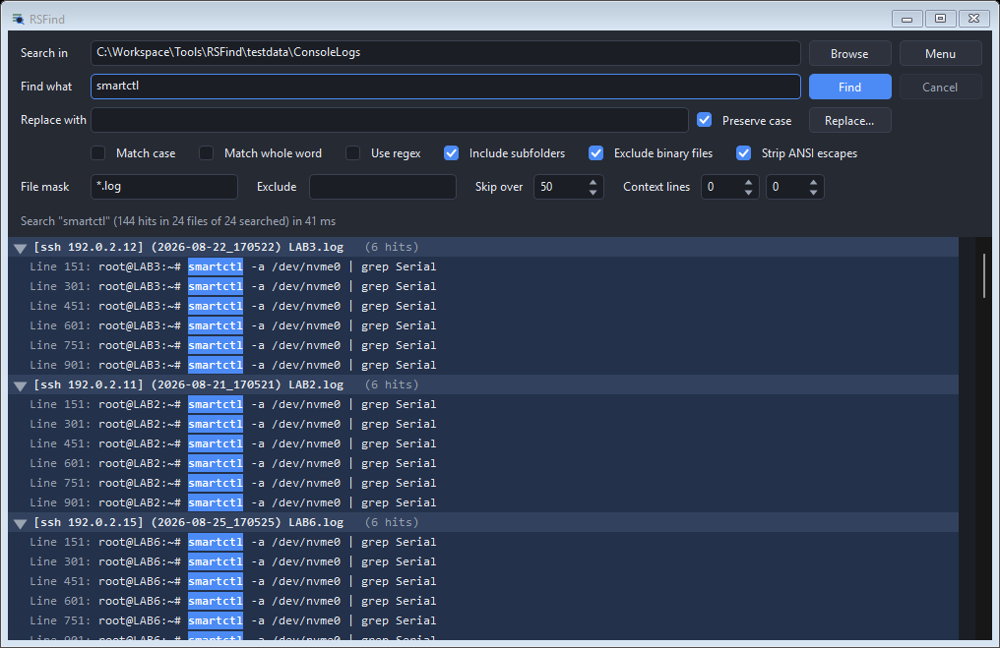
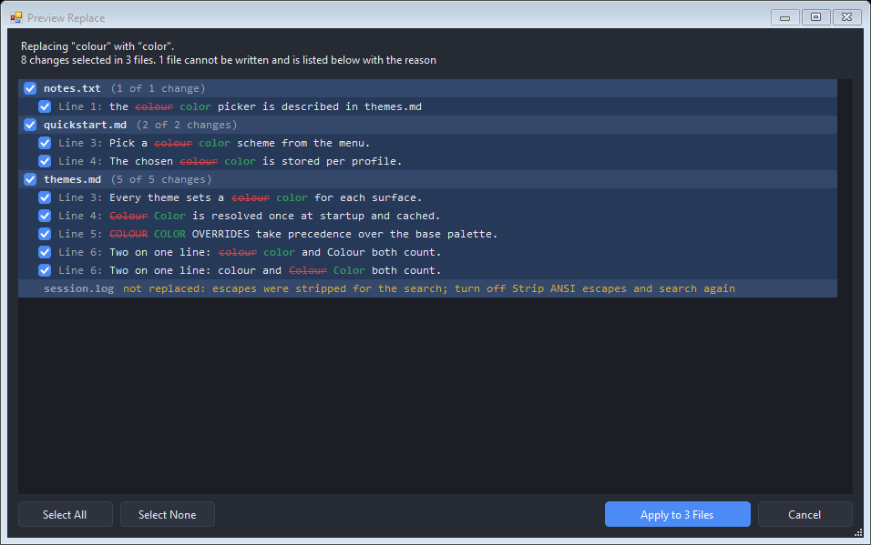

# RSFind

Search the text *inside* the files in a folder, on demand. Point it at a
directory, type what you remember, and get every line that contains it,
grouped by the file it came from.

It builds no index, installs no service, and watches nothing in the
background. That is the point: it is the tool you reach for on the day
Windows Search returns filenames and nothing else.



## What it does

- **Searches file contents, right now.** No indexer to wait for, no catalog to
  go stale, no folders to opt in ahead of time.
- **Groups hits by file**, collapsible, with the match highlighted in place and
  optional context lines above and below.
- **Streams results as it goes**, with a Cancel button that actually stops the
  scan rather than hiding it.
- **Understands terminal logs.** Raw session logs carry ANSI escapes; RSFind
  strips them before matching, so a phrase that straddles a color code is still
  findable and the results read like the terminal did.
- **Reads inside `.xlsx` and `.docx`**, with no Office install and no
  dependency. A spreadsheet hit reports itself as `Schedule!A2` - a reference
  you can paste into the Name Box - and a document hit as `Paragraph 1` or
  `Header 1, paragraph 1`.
- **Names the formats it cannot read** instead of returning nothing. A folder
  of PDFs that answers "no hits" is a missing capability wearing the clothes of
  an answer.
- **Handles encodings that trip other tools.** UTF-8 with or without a BOM,
  UTF-16 and UTF-32 with one, and old ANSI exports, all in the same folder.
- **Adds itself to the folder right-click menu**, per user, without admin.

## Quickstart

Build it with the C# compiler already inside Windows. There is no SDK to
install, nothing to restore, and no network access at any point:

```bash
Build-RSFind.cmd
```

Then run `RSFind.exe`. To put it in Explorer, open **Menu > Add to Explorer
Right-Click Menu**; right-clicking a folder (or the empty space inside one)
then offers **Find Text with RSFind**, which opens the app already pointed at
that folder. The same menu item removes it again.

You can also pass a folder on the command line: `RSFind.exe C:\logs`.

## Options

| Option | What it does |
|---|---|
| Match case | Off by default, so `Serial` finds `SERIAL`. |
| Match whole word | `nvme0` stops matching inside `nvme0n1`. |
| Use regex | .NET regular expressions. A half-typed pattern reports itself on the summary line instead of throwing. |
| Include subfolders | On by default. |
| Exclude binary files | On by default. A NUL byte in the first 8 KB means binary - unless a byte-order mark says otherwise, because UTF-16 text is half NUL bytes. |
| Strip ANSI escapes | On by default. See the note below. |
| File mask | `*.log;*.txt` - semicolons, commas, or spaces all separate. Blank means every file. A bare `.log` is read as `*.log`. |
| Exclude | Same syntax, applied first. Exclude beats include. |
| Skip over | Files larger than this many MB are not read. 0 means no limit. |
| Context lines | How many lines to show before and after each hit. |

Preferences live in `%APPDATA%\RSFind\settings.ini`, which is a plain
`key=value` file you can read and edit. **Search queries are never written
there, and no history of past searches is kept.** A query typed against a
folder of console logs is as likely to be a serial number, a hostname, or a
password as it is to be `smartctl`, and a search tool that quietly keeps a list
of everything you looked for is a tool you have to think about before using.

### Two defaults worth knowing about

**Strip ANSI escapes is on.** Terminal session logs are full of escape
sequences; with stripping off, every prompt line renders as a row of boxes and
a phrase that spans a color code cannot be matched at all. Turn it off when you
want to see exactly what is in the bytes. It is one checkbox either direction.

**Results are capped** at 5,000 hits per file and 200,000 in total. A search
for a common word across a log folder is one keystroke away, and the cap is
what keeps that from becoming a memory problem. Whenever a cap bites, the
summary line says so - a short list that does not admit it is short reads as
"that is all there is", which is the one thing a search tool must never imply.

## Office files

`.xlsx`, `.xlsm`, `.docx`, and `.docm` are ZIP archives full of XML, and both a
ZIP reader and an XML reader ship inside Windows. So this costs two in-box
references rather than an Office install, an interop assembly, or a package you
would have to trust.

These files are handled *before* the binary check, not after - a workbook is a
ZIP, a ZIP is full of NUL bytes, and the binary sniff is right about that. The
order is what stops the exclude-binary default from silently discarding the one
format this feature exists to read.

What is worth knowing about what comes out:

| | |
|---|---|
| Spreadsheet cells | Reported as `Sheet name!B14`. Shared strings, inline strings, numbers, and cached formula results are all searched. |
| Formulas | **Not** searched. Searching them would answer `SUM` with every totaled column in the workbook. A formula cell yields its result; an uncalculated one yields nothing. |
| Dates | Stored by Excel as serial numbers, and searched as stored. Searching for `2026-09-14` will not find a real date cell - search the text around it. |
| Word paragraphs | Runs are joined first, so a phrase still matches when Word split it across runs at a formatting change. That splitting is why a naive reader cannot find a sentence containing one bolded word. |
| Headers, footers, footnotes, endnotes, comments | All searched, and labeled. A change number or a classification marking usually lives in a header, and that is exactly what people search a folder of documents for. |
| Tracked deletions | Skipped. Text inside a `w:del` is not in the document any more, and matching it reports a phrase that is not there when the file is opened. |
| Context lines | Not offered for these formats. The cell above a hit is not context the way the line above one is. |

Double-clicking one of these opens the file with its normal application, and
ignores any editor command you have set - handing a workbook to a text editor
with a `-n14` argument opens a ZIP as text at line 14.

`.xls`, `.doc`, `.ppt`, `.pptx`, `.pdf`, `.rtf`, `.odt`, and `.ods` are **not**
read. They are counted separately and named on the summary line, so the number
you get back is never quietly incomplete.

## Replace

Type a replacement, press **Preview**, and read what would change before
anything is written. There is no way to replace without going through that
window - the preview is not a confirmation step bolted on, it is the only path
through the feature.



<!-- charcheck:spelling-off - the examples below are the feature, not drift -->

**It preserves the case of what it replaced.** `colour` becomes `color`,
`Colour` becomes `Color`, and `COLOUR` becomes `COLOR`. This is what makes a
British-to-American pass over a documentation folder produce a clean diff
instead of a hundred new sentence-case mistakes. It only reshapes a replacement
you typed entirely in lower case: one carrying its own capitals - `RSFind`,
`macOS` - was written that way on purpose and is used literally. Turn the whole
behavior off with the **Preserve case** checkbox.

One honest caveat the tool cannot solve for you: substring replacement is right
for `colour`, which carries `colours` and `coloured` along correctly, and wrong
for `grey`, which would take `greyhound` with it. **Match whole word** is the
mitigation and the preview is the backstop.

<!-- charcheck:spelling-on -->

### What it refuses, and why

Refused files appear in the preview with their reason, greyed out. They are
never hidden - a file that silently declines to change is the worst possible
outcome here.

| Refused | Why |
|---|---|
| A file changed since the search | Three checks: size, timestamp, and re-reading every line being edited. The last one catches an edit that kept the same size and restored the timestamp. |
| An Office file | The text was extracted from a ZIP. Writing it back would destroy the file. |
| A file whose escapes were stripped | The match positions point at cleaned text, not at the bytes on disk. Turn off **Strip ANSI escapes** and search again. A file containing no escapes is unaffected and can still be replaced. |
| A binary | Regardless of the exclude-binary setting. Unchecking that box to find a string inside a firmware image is not a request to rewrite it. |
| A replacement the encoding cannot store | An ANSI codepage silently turns what it cannot store into a question mark and reports success. Refusing beats losing the character. |

### Undo

Every run copies the original files into `%APPDATA%\RSFind\undo\<timestamp>\`
before writing. **Menu > Undo Last Replace** puts them all back as a unit, and
skips any file that has been edited since - restoring over someone's later work
would be a worse mistake than the one being undone.

### Limits

- Runs are capped at 5,000 changes. Above that the preview stops being a
  preview, so RSFind refuses and asks you to narrow the search instead of
  showing a sample and implying the rest was reviewed.
- Files are written through a temporary file and swapped, so an interrupted
  write leaves the original intact rather than half a file.
- In regex mode, `$1` and friends are substituted. In literal mode a
  replacement containing `$1` is written exactly as typed.

## Working with the results

**Ctrl+F narrows what is on screen.** A search across a hundred session logs
answers with a thousand hits, and the next question is usually "which of these
was on LAB4" - a question about the results, not a reason to search the disk
again. Type a host, an address, or a timestamp and the pane shows only what
matches, with a count of what it is hiding. Escape puts everything back.

It filters rather than stepping match to match, because a host appears on
dozens of rows: find-next would mean pressing it dozens of times, where a
filter answers in one go and leaves a short list to double-click. Enter moves
focus into that list.

A filter matching a **filename** keeps that file's hits whole, since the host
is in the name rather than in any of the matched lines. A filter matching a
**line** keeps that hit on its own.

**Right-click** the results for Copy Selected, Copy All Results, Copy Path,
Open Containing Folder, Find in Results, and Expand or Collapse All. Copy All
Results is for pasting a whole result set into a second file and reading it
there. It copies everything the filter admits, whether or not a group happens
to be collapsed - collapsing is a way to get a long list out of the way while
reading, not a statement about what you want to keep.

## Opening a result

Double-click a hit, or press Enter. **Double-clicking a file header opens that
file too**, at its first match rather than at line 1. To collapse a group,
click the triangle in the indent to its left, or use the left and right arrow
keys.

By default the file opens with whatever Windows associates. To jump straight to
the line, set an editor command under **Menu > Editor Command**, using `{file}`
and `{line}` as placeholders:

```
notepad++ {file} -n{line}
```

## What it deliberately does not do

- **No index and no background service.** Nothing runs when the window is
  closed, so there is nothing to trust, nothing to update, and nothing that
  could have been reading your disk while you were not looking.
- **No network access, ever.** No update check, no telemetry, no crash
  reporting. The binary references only assemblies that ship with Windows.
- **No replace without a preview.** There is no command-line replace, no
  "replace all" that skips the window, and no way to reach the write path
  except by reading what it would do. That is deliberate: it is the one button
  here that can quietly damage a directory.
- **No `.xls`, `.doc`, or `.pdf`.** The modern zipped formats are read; the
  older binary ones and PDF are not, and RSFind says so on the summary line
  rather than letting them count as searched.
- **No search history.** See above.

## Requirements

Windows with .NET Framework 4.x, which every supported version of Windows
already has. Nothing else.

## License

The Unlicense. See [LICENSE](LICENSE).
